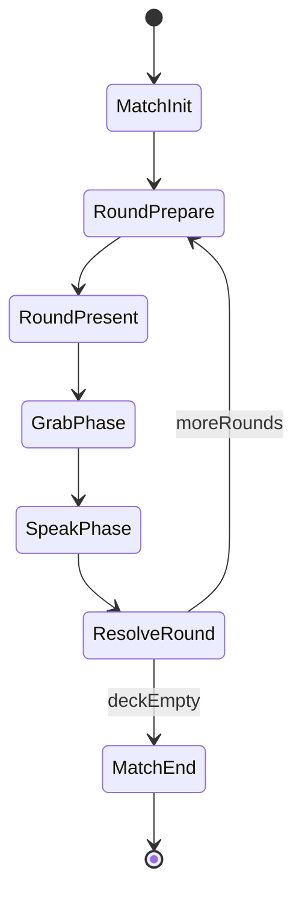

# Blitz Onomatopoeico — Complete Technical Architecture Blueprint

## 1. High-level overview

**Product shape:** A session-based educational party game where each **match** fixes **three** phoneme / letter–sound objects on the table (the only valid grabs each round). Each **round** presents a **card that is always “about” one target letter** (`CardLetterId`) and, on that card, **a single stimulus pair: figure + sound** — one **visual channel** (illustration / glyph / figure tied to the letter) and one **sound channel** (written onomatopoeia + audio cue). Players (and bots) grab the correct physical object among the **three**, then **speak** the sound (no ASR). Correct resolution awards the card toward a **match score**. **Difficulty** scales bot latency, distractor / cue difficulty, and deck size.

**Card layout (canonical):** **One letter focus** + **one pair (figure + som)** — not multiple independent slots; the pair is what the player reads and hears before grabbing.

**Scope note vs original pitch:** The classroom pitch mentioned five objects; this architecture standardizes on **three options** and **one card** structured as **one letter + one (figure + sound) pair** for faster reads, simpler layout, and easier uniqueness proofs in the generator.

**Architectural pillars:**

- **Gameplay core is mode-agnostic:** Pure C# rules for “what is the correct answer for this card + table set” live in a small **rules / validation** module with no UnityEngine dependencies where practical (testable, reusable for bots and server).
- **Presentation is swappable per minigame:** 3D table, card visuals, ghost minigame props are **prefab-driven**; code discovers **anchors** and **registered interactables** instead of hardcoded transforms.
- **Multiplayer is an adapter:** Local + NGO paths share **IMatchSession** / **IRoundAuthority** abstractions; only the **network façade** changes. **Server authority** for scoring, grab validation, and bot simulation in MP; **host or local** authority in SP.
- **UI is UI Toolkit only** for menus, lobby shell, HUD, results; gameplay feedback can still use world VFX/audio via **GameplayFeedbackBus** (decoupled from UXML).

**Recommended assembly split (enforces dependency direction):**


| Assembly         | References allowed           | Purpose                                                                  |
| ---------------- | ---------------------------- | ------------------------------------------------------------------------ |
| `Blitz.Core`     | None / minimal Unity         | Rules, DTOs, RNG contracts, interfaces                                   |
| `Blitz.Gameplay` | Core, UnityEngine            | Minigames, interactables, bots, local sim                                |
| `Blitz.UI`       | Core, UnityEngine.UIElements | Views, presenters, binding helpers                                       |
| `Blitz.Netcode`  | Core, Gameplay, NGO          | Network prefabs, RPC bridges, spawn logic                                |
| `Blitz.App`      | All                          | Composition root, scene bootstrap, ServiceLocator or explicit installers |


---

## 2. Project structure

**Folders under `Assets/` (game content at the same level as existing Unity folders such as `Settings/` — no `_Project` root):**

```
Assets/
  Art/                      # Meshes, sprites, materials (by theme)
  Audio/                    # Phoneme clips, UI SFX, music
  Prefabs/
    Core/                   # NetworkManager bootstrap, AppRoot
    Table/                  # TableLayoutRoot, SoundObject_Base, CardAnchor
    Minigames/
      BlitzOnomatopoeico/
      FantasmaLadraoSons/
    UI/                     # UIDocument host prefabs only if needed
  Scenes/
    00_Bootstrap.unity           # Loads config; optional single persistent
    10_MainMenu.unity
    20_Lobby.unity               # Shell + NGO lobby UI (stub ok)
    30_Gameplay_Core.unity      # Shared lighting, event systems, audio
    31_Minigame_Blitz.unity      # Additive scene (table + props)
    32_Minigame_Fantasma.unity
  ScriptableObjects/
    Letters/
    Sounds/
    Difficulty/
    Minigames/
    Bots/
  Settings/                 # Input actions, URP assets (existing; keep as-is)
  UI Toolkit/
    UXML/
      Common/
      MainMenu/
      Lobby/
      HUD/
      Results/
      Leaderboard/
    USS/
      Theme.uss
      Components/
    Resources/              # PanelSettings asset reference if used
  Scripts/
    Core/
    Gameplay/
      Input/
      Cards/
      Table/
      Bots/
      Minigames/
      Feedback/
    UI/
      Binding/
      Views/
      Presenters/
    Networking/
      NGO/
      Lobby/
    App/
  Tests/                    # EditMode for rules; PlayMode for round flow
```

**Convention:** All paths above are `**Assets/<Folder>`** (e.g. `Assets/Scripts/Core`). Do **not** nest the game under `Assets/_Project/` so designers and CI scripts have predictable locations and the tree stays parallel to `Assets/Settings`.

**Scene strategy:**

- **Bootstrap** (optional): `AppLifetimeScope` sets static services, loads `MainMenu`.
- **Gameplay_Core** always loaded first; **minigame scenes** loaded **additively** via `IMinigameLoader` so designers swap entire environments without touching core code.
- Each minigame scene contains: **TableLayoutRoot** prefab instance, **MinigameContext** prefab (wires references), **Lighting override** volume if needed.

**Separation map:**

- **Core:** data contracts, card logic, scoring math, RNG service interface.
- **Gameplay:** Unity behaviours, interactables, bots, round orchestration **implementations** for offline/host.
- **Networking:** thin **synchronizers** and **RPC surfaces** that call into Gameplay authority interfaces.
- **UI:** never directly queries physics; subscribes to **read models** / events from session.

---

## 3. Core systems (responsibilities and relationships)

```mermaid
flowchart TB
  subgraph app [App]
    GameAppController
  end
  subgraph session [Session]
    MatchSession
    RoundController
  end
  subgraph rules [Rules Core]
    CardGenerator
    AnswerResolver
  end
  subgraph table [Table]
    TableRuntimeRegistry
    SoundObjectRuntime[]
  end
  subgraph agents [Agents]
    LocalPlayerAgent
    BotAgent[]
  end
  subgraph ui [UI]
    UIPresenterLayer
  end
  GameAppController --> MatchSession
  MatchSession --> RoundController
  RoundController --> CardGenerator
  RoundController --> AnswerResolver
  RoundController --> TableRuntimeRegistry
  LocalPlayerAgent --> RoundController
  BotAgent --> RoundController
  RoundController --> UIPresenterLayer
```


| System                | Primary types (suggested names)                                                                                                                     | Responsibility                                                                                                                                                                                                                                                                                                                                                                                                                                                                |
| --------------------- | --------------------------------------------------------------------------------------------------------------------------------------------------- | ----------------------------------------------------------------------------------------------------------------------------------------------------------------------------------------------------------------------------------------------------------------------------------------------------------------------------------------------------------------------------------------------------------------------------------------------------------------------------- |
| **GameManager**       | `GameAppController`, `ApplicationStateMachine`                                                                                                      | Top-level app states: Boot, Menu, Lobby, Match, Pause, Quit. Owns scene load requests, audio mixer snapshots, quality tier.                                                                                                                                                                                                                                                                                                                                                   |
| **MatchManager**      | `MatchSession`, `MatchConfig`, `MatchClock`                                                                                                         | Configures difficulty, total cards, participant list (human + bots), win/lose conditions, transitions to results.                                                                                                                                                                                                                                                                                                                                                             |
| **CardSystem**        | `CardGenerator`, `GeneratedCard`, `CardPresentationPair` (figure + sound cue), `ICardVisualFactory`                                                 | Each card: `**CardLetterId`** (the letter the round is about) + **one pair** — `**FigureVisualId`** (art / mesh / illustration channel) + `**CuePhonemeId**` (written onomatopoeia + audio). Builds from `**ActiveLetterSoundSet` (3 letters/phonemes)**. Emits immutable `GeneratedCard` DTOs. Rules compare `**CuePhonemeId`** to `T(CardLetterId)`; the figure is usually consistent with that letter but policy may allow deliberate visual twists in advanced minigames. |
| **SoundObjectSystem** | `SoundObjectDefinition` (SO), `SoundObjectInstance` (Mono), `TableRuntimeRegistry`, `ITableLayoutSource`                                            | Binds `**Slot_0..Slot_2`** to the three runtime phonemes; exposes `SoundObjectId` **0–2** → world instance; handles highlight/disabled states.                                                                                                                                                                                                                                                                                                                                |
| **InputSystem**       | `IGrabInputSource`, `GrabPointerDriver` (mouse/touch/pointer), `InputActionReference` wiring                                                        | Normalizes ray/pointer → `GrabCandidate`; raises `GrabIntentEvent` with object id + time; one-hand = single active pointer channel (configurable second pointer ignored).                                                                                                                                                                                                                                                                                                     |
| **BotSystem**         | `BotAgent`, `BotPersonalityProfile` (SO), `BotDecisionService`                                                                                      | Uses same `AnswerResolver` as humans; schedules `GrabIntent` + optional `SpeakQueued` after **reaction delay** from difficulty; never bypasses server checks in MP.                                                                                                                                                                                                                                                                                                           |
| **MinigameSystem**    | `IMinigame`, `MinigameContext`, `MinigameRegistry` (SO list), `MinigameSceneHandle`                                                                 | Selects minigame, loads additive scene, injects services, forwards lifecycle.                                                                                                                                                                                                                                                                                                                                                                                                 |
| **DifficultySystem**  | `DifficultyProfile` (SO): bot timing ranges, **distractor / cue tier** (not extra card rows — always **one letter + figure/sound pair**), deck size | Selected in menu; produces `MatchRules` consumed by generator and bots.                                                                                                                                                                                                                                                                                                                                                                                                       |
| **ScoreSystem**       | `ScoreLedger`, `RoundOutcome`, `IPointsPolicy`                                                                                                      | Awards points for won cards, streak bonuses optional; emits domain events.                                                                                                                                                                                                                                                                                                                                                                                                    |
| **RankingSystem**     | `LeaderboardRepository`, `PlayerProfile`                                                                                                            | Persists top N scores with player name; read/write behind interface.                                                                                                                                                                                                                                                                                                                                                                                                          |
| **NetworkingSystem**  | `NetworkGameBootstrap`, `NetworkMatchBridge`, `ServerRoundAuthority`                                                                                | Hosts NGO setup, spawns session `NetworkObject`, routes RPCs to `MatchSession` server implementation.                                                                                                                                                                                                                                                                                                                                                                         |
| **LobbySystem**       | `LobbyServiceStub` → future `UnityLobby` / Relay                                                                                                    | Data model for up to **8** seats, ready flags, cosmetic slots; UI only depends on `ILobbyViewModel`.                                                                                                                                                                                                                                                                                                                                                                          |


**Key interfaces (contracts, not implementations):**

- `IMatchSession` — start/end match, enqueue rounds, expose read-only state for UI.
- `IRoundFlow` — present card, open grab window, resolve grabs, declare winner of card.
- `IAnswerResolver` — `Resolve(GeneratedCard activeSet) → SoundObjectId` (pure).
- `IGrabValidator` — server/local checks: window open, not already resolved, object allowed.
- `INetworkRoundSynchronizer` — no-op offline; NGO impl pushes state deltas.

---

## 4. Networking architecture (NGO)

**Packages (to add when implementing):** `com.unity.netcode.gameobjects`, `com.unity.transport`, and later `com.unity.services.lobby` / `com.unity.services.relay` if using Unity Gaming Services.

**NetworkManager setup:**

- Dedicated prefab `NetworkBootstrap` in **Bootstrap** or **Gameplay_Core**: `NetworkManager` + `UnityTransport` + custom `INetworkPrefabHandler` if using Addressables later.
- **Session NetworkObject:** single `NetworkObject` `NetMatchSession` (server-spawned) holds references to **registered table** and **player seat map** (client id → seat index).

**NetworkObject strategy:**


| Entity                | NetworkObject?                         | Notes                                                                                                                                          |
| --------------------- | -------------------------------------- | ---------------------------------------------------------------------------------------------------------------------------------------------- |
| `NetMatchSession`     | Yes (server)                           | Authoritative match/round state machine                                                                                                        |
| Each **sound object** | Optional                               | Prefer **server-validated grabs** referencing `**SoundObjectId` 0–2** (byte) via RPC rather than syncing every transform                       |
| **Card visual**       | Client-local or NetworkVariable struct | Large visuals: replicate **compact `CardStateHash`** or `GeneratedCard` compressed blob; clients instantiate visuals from shared prefab + hash |
| **Bots**              | No                                     | Simulated only on server; appear as `ParticipantId` with `IsBot=true` in replicated roster                                                     |


**Ownership model:**

- **Server** owns: round phase, correct answer, who won card, scores, RNG seed (if synced), bot actions.
- **Client** owns: local input intent, local UI, cosmetic animations driven by replicated state.
- Use **ClientRpc** for feedback (SFX, highlight) triggered after server validation; avoid client-pre-awarding points.

**RPC usage (minimal, purposeful):**

- `SubmitGrabServerRpc(ParticipantId pid, SoundObjectId obj, float clientTime)` — server validates time window (with small tolerance), order of arrival, anti-double-submit token per round.
- `RoundStateClientRpc(RoundStateDto)` — phase changes: Intro, RevealCard, GrabOpen, Resolve, ScoreUpdate.
- `PlayBotSpeakClientRpc(seatIndex, phonemeClipId)` — optional: server tells clients to play bot learning line (volume ducking via mixer).

**Server authoritative vs prediction:**

- **Authoritative:** grab resolution, score, card progression, RNG for match (server generates or receives host seed and distributes).
- **Prediction (optional, low priority):** local **immediate visual hover/press feedback** on interactables; **do not** predict score or ownership of card. If grab rejected, play “fail” feedback ClientRpc.

**Grab synchronization:**

- Clients send **intent + monotonic round id** only.
- Server broadcasts **first valid winner** among humans/bots for that round (configurable tie-break: lowest latency simulated timestamp, or simultaneous discard + replay round — pick one in design doc for production: recommend **server timestamp order** with identical `GrabTime` rare edge → no one wins card, optional reshuffle).

**Bots in multiplayer:**

- Bots exist only in `ParticipantRoster` on server; `BotScheduler` runs server-side `Update`/`FixedUpdate` tied to server tick.
- Bots use same `BotDecisionService` as offline; **never** send fake `ServerRpc` from clients. Server injects bot grabs as internal `ProcessGrabIntent` after delay.

---

## 5. Data architecture

**ScriptableObjects (static, editor-authored):**

- `**LetterDefinition`** — id, display name, default grapheme art refs, optional 3D mesh for Fantasma minigame.
- `**PhonemeDefinition**` — id, IPA-ish tag, primary audio clip, lip-sync viseme set optional.
- `**LetterPhonemeMapping**` — canonical “this letter’s taught sound” for a given curriculum locale (supports future regional variants).
- `**SoundObjectVisualSet**` — prefab variants per object “personality” (color, mesh) keyed by slot style.
- `**DifficultyProfile**` — fields below in section 7/8 interplay.
- `**MinigameDescriptor**` — `MinigameId`, additive scene name, thumbnail, required capabilities (`Needs3DTable`, `CardStyle`), factory reference.
- `**BotPersonalityProfile**` — delay distributions, mistake probability curve (0 for “teaching” bots if desired), speak cadence.

**Runtime models (immutable where possible):**

- `**MatchRules`** — struct from difficulty: `TotalRounds`, `GrabWindowSeconds`, `**TableOptionCount` = 3** (constant or config for future variants), `DistractorTier` / cue complexity, bot params. **Card layout:** always **one letter + one (figure + sound) pair** — not multiple slots.
- `**ActiveLetterSoundSet`** — **three** `LetterPhonemePair` entries with **runtime assigned `SoundObjectId` 0–2** (permutation of which phoneme sits on which physical slot).
- `**GeneratedCard`** — `**CardLetterId**`: the **target letter** the student reasons about. `**CardPresentationPair`**: `**FigureVisualId**` (visual channel — sprite/mesh ref id) + `**CuePhonemeId**` (sound channel — onomatopoeia + clip). `**CardMode**`: `HasTruePair` when `CuePhonemeId == T(CardLetterId)`; `ExclusionMismatch` when the cue does **not** match the true sound of that letter (exclusion over the **three** objects). Serialize as one struct for NGO; optional nested `CardSlot` type alias for legacy naming.
- `**LeaderboardEntry`** — name, score, minigame id, date, difficulty.

**Data-driven flow:**

- Designers tune **content libraries** (letters, phonemes, art) independently of generator rules.
- `CardGenerationPolicy` (SO) references allowed **mismatch strategies** per difficulty (e.g., swap neighbor sounds only).

---

## 6. Game flow

**Application state machine (top-level):**

`Boot` → `MainMenu` → (`SoloSetup` | `Lobby`) → `MatchLoading` → `Match` → `Results` → `Leaderboard` → `MainMenu`

**Match sub-state machine (`MatchSession`):**

`MatchInit` → `RoundPrepare` (select RNG, build card) → `RoundPresent` (animate card) → `GrabPhase` → `SpeakPhase` (honor system: timed prompt; skip strict validation) → `ResolveRound` → (`NextRound` | `MatchEnd`)




**Singleplayer vs multiplayer:**

- **SP:** `LocalMatchSession` implements `IMatchSession`; `RoundFlow` runs in Update without NGO.
- **MP:** `ServerMatchSession` mirrors same states; clients mirror via `NetworkVariable<MatchPhaseByte>` + `OnValueChanged` → UI presenter.

---

## 7. Bot design

**Reaction timing:**

- Draw `delay ~ Uniform(min,max)` or **log-normal** for skew (humans rarely instant) from `DifficultyProfile`.
- Add **per-bot jitter** from `BotPersonalityProfile`.
- Clamp by `GrabWindowSeconds` so bots always act inside window with margin `epsilon`.

**Decision-making:**

- Compute `correctObjectId = AnswerResolver.Resolve(card, activeSet)`.
- **Accuracy model:** With probability `pCorrect(difficulty)`, pick correct object; else pick a **random wrong** object excluding ones that would be **instantly invalid** under rules (optional teaching mode: always correct on Easy).
- **Exclusion cards:** wrong picker must still avoid objects that would be ambiguous; use generator guarantees so any wrong is “legal mistake” but still objectively incorrect.

**Audio playback:**

- `BotSpeakController` plays `PhonemeDefinition` clip on **2D** or **spatial** seat location; duck music via **AudioMixer** snapshot.
- In MP, server triggers `PlayBotSpeakClientRpc` so all clients hear learning reinforcement.

**Difficulty differences:**

- Easy: longer delays, higher `pCorrect`, **gentler distractor phonemes** (cue farther from correct sound in similarity graph).
- Medium: baseline distractor tier.
- Hard: short delays, lower `pCorrect`, **phonetically closer distractors** for the single cue, shorter speak window optional.

---

## 8. Card generation logic (unambiguous, exactly one correct answer)

**Card semantics (aligns with design language):** A round’s card is **one letter** (pedagogical anchor) plus **one pair of stimuli: figure + sound**. The **sound** (`CuePhonemeId`) is what enters the positive / exclusion rules against `T(CardLetterId)`. The **figure** (`FigureVisualId`) supports recognition; by default it depicts the same `CardLetterId`, but minigames may vary figure assets under `CardGenerationPolicy` as long as rules and player copy stay clear.

**Definitions (for a match):**

- Fixed set `A = {L0, L1, L2}` — **three** letters, each with **true** phoneme `T(Li)` (**bijection** between those three letters and the three table phonemes).
- Table maps `SoundObjectId j ∈ {0,1,2}` → phoneme `Pj` (**permutation** of the three phonemes in play — what each physical object “is” this match).

**Displayed card — one letter + one (figure + sound) pair:**

- `**CardLetterId` = `L_card`** — the letter the card is **about** (always one of `A`).
- **Figure channel:** visual chosen from content (`FigureVisualId`) — normally the illustration / glyph for `L_card`.
- **Sound channel:** `**CP` = `CuePhonemeId`** — cue phoneme shown + played on reveal (from the closed set of three phonemes in play unless policy extends distractors).

**Truth for the sound channel relative to the card letter:**

- **True pair (positive mode):** `CP == T(L_card)` — the **som** on the card is the correct sound for the **letra** the card names.
- **Mismatch (exclusion mode):** `CP != T(L_card)` — the cue is **not** the true sound of `L_card`; player applies **exclusion** over the three objects.

**Player rules recap (use `L_card` and `CP`):**

1. **Positive rule:** If `CP == T(L_card)`, grab the object whose table phoneme is `**CP`**.
2. **Exclusion rule:** If `CP != T(L_card)`, grab object `j` such that:
  - `Pj ≠ CP` (object’s phoneme identity is **not** the cue on the card), **and**
  - `L(Pj) ≠ L_card` where `L(p)` is the unique letter in `A` whose true sound is `p`.

**Uniqueness guarantee (construction invariants):**

- Closed universe of **three** letters and **three** phonemes.
- **Positive card:** enforce `CP == T(L_card)`; exactly one object has `Pj = CP` among the three — that `j` is the unique answer.
- **Exclusion card:** enforce `CP != T(L_card)`. Let `ShownPhonemes = {CP}`, `ShownLetters = {L_card}`. Candidate set `S = { j | Pj ∉ ShownPhonemes ∧ L(Pj) ∉ ShownLetters }`. **Generator must verify `|S| == 1`** before emitting; else discard and regenerate (bounded retries). Brute-force over **3!** layouts and small discrete `(L_card, CP)` choices is trivial in EditMode tests.

**Difficulty scaling (single letter + figure/sound pair):**

- Easy: **clearer figure** for `L_card`, cue phoneme **far** from correct in `PhonemeSimilarityGroup`, longer audio reveal.
- Medium: baseline similarity tier.
- Hard: **phonetically closer** wrong `CP` for the same `L_card`, shorter grab window, optional faster card flip animation.

---

## 9. Interaction model

**Pipeline:**

`IGrabInputSource` → `GrabRaycaster` (Physics.Raycast / SphereCast) → `IInteractable` hit → `SoundObjectInstance` → emits `GrabIntent(SoundObjectId, timestamp)` → `RoundController.TryRegisterGrab`.

**Touch / mouse abstraction:** Unity **Input System** with a single **Press/Position** action map; `UIInputModule` for Toolkit stays separate — **disable UI raycasts** during grab phase or give grab priority via `EventSystem` ordering.

**Feedback layers:**

- **Hover:** material / outline via `InteractableFeedback`.
- **Success/Fail:** `GameplayFeedbackBus` raises events consumed by VFX pool + UI HUD flash.
- **Haptics:** optional `IHapticsPlayer` behind platform compile.

---

## 10. Scalability strategy

- **Minigames as plugins:** each implements `IMinigame` + ships its own additive scene + SO descriptor; **no edits** to core enums when adding; register in `MinigameCatalog` SO.
- **Composition:** `RoundController` depends on `ICardPresenter`, `ITablePresenter`, `IAudioDirector` — minigames supply concrete presenters via `MinigameContext` prefab wiring.
- **Inheritance sparingly:** prefer **small abstract base** `MinigameBase` for boilerplate (load/unload), **interfaces** for capabilities (`ISupports3DLetters`, `ICustomCardLayout`).
- **Scene vs prefab:** **Scene** for lighting/environment; **Prefab** for reusable table layouts (`TableLayout_Variant_A` nested under `TableLayoutRoot`).

---

## 11. Minigame framework

`**IMinigame` lifecycle:**

- `OnRegister(MinigameServices services)` — cache factories, audio, DI.
- `OnSceneLoaded()` — bind anchors, spawn local props.
- `OnMatchBegin(MatchConfig)` — table permutation, skin.
- `OnRoundBegin(GeneratedCard)` — present visuals; may override card mount animation.
- `OnRoundEnd(RoundOutcome)` — cleanup.
- `OnMatchEnd()` — release pooled instances.
- `OnUnregister()` — unload additive scene.

**Services bag (`MinigameServices`):** read-only access to `IAudioDirector`, `IPlayerVisualRegistry`, `IPrefabSpawner`, `IInputRouter`.

**Example A — `BlitzOnomatopoeico`:** 2D/3D hybrid table, **three** prop objects with colliders; **single-slot** `GeneratedCard` on a plane; uses default `AnswerResolver`.

**Example B — `FantasmaLadraoSons`:** 3D colored letters; cards deliberately mismatched; player picks **letter object** instead of generic sound prop — implement `ISolutionSpaceAdapter` so `AnswerResolver` maps to **LetterObjectId** instead of `SoundObjectId`, or unify concept as `GrabTargetId` with table registry polymorphism.

---

## 12. UI architecture (UI Toolkit)

**UXML structure:**

- `MainMenu.uxml` — buttons, difficulty selector, name field, continue.
- `Lobby.uxml` — 8 seat rows (`LobbySeatRow.uxml` template), ready toggles (future), host controls.
- `HUD.uxml` — round timer, score strip, card container host (`VisualElement` named `CardMount`), prompt labels (“Diz o som!”).
- `Results.uxml` — placements, XP optional stub.
- `Leaderboard.uxml` — `ListView` bound to entries.

**USS strategy:**

- **Single `Theme.uss`** with variables (`--color-primary`, spacing tokens).
- **Component USS** per widget (`ButtonPrimary.uss`) included from UXML `<Style src=...>`.

**Pattern: View + Presenter + ViewModel**

- **View:** `UIDocument` host Mono `MainMenuView` — finds queries, wires callbacks only.
- **ViewModel:** plain C# `MainMenuViewModel` implements `INotifyPropertyChanged` (custom lightweight) or Unity `BindableProperty` wrappers (Unity 6+); exposes `string PlayerName`, `DifficultyOption SelectedDifficulty`.
- **Presenter:** `MainMenuPresenter` connects VM properties to UI via:
  - **Scheduled binding:** `visualElement.schedule.Execute(() => sync()).Every(16)` for simple projects, OR
  - **Unity runtime binding** where version supports `Binding` paths in UXML.
- **Navigation:** `IUINavigator` pushes stack of `UIPanelController` structs.

**Separation:** UI listens to `**IMatchSession.ReadOnlyState`** events; never calls `Physics.Raycast`.

---

## 13. Drag-and-drop scene composition

**Prefab roles:**

- `**TableLayoutRoot`** — empty with child anchors: `**Slot_0..Slot_2**` (Transform), optional `CardAnchor`, `HUDWorldSpaceAnchor`.
- `**SoundObject_Base**` — contains `Collider`, `SoundObjectInstance`, hiasmghlight child; **no hardcoded letter**; receives binding at runtime.
- `**MinigameContext`** — serialized references to `TableLayoutRoot`, `CardPresenter`, audio sources.

**Designer workflow:**

1. Duplicate `TableLayout_Default` prefab, rearrange slots in scene view.
2. Assign layout prefab reference on `MinigameContext` in inspector.
3. Drop optional environmental props (cloth, lights) in additive minigame scene.

**Minimal coupling:** `TableRuntimeRegistry` scans anchors by name convention OR `TableSlotMarker` components with `slotIndex` int.

---

## 14. Multiplayer preparation details (checklist)

- Introduce NGO packages and a `**NetworkPrefabsList`** containing `NetMatchSession` + any networked feedback spawner.
- **Single build** with **host + client** test harness scene buttons (dev only).
- **Serialization:** all DTOs used in RPCs marked with `INetworkSerializable` or use primitives only.
- **Determinism:** if clients pre-simulate visuals, they still wait for server for outcomes.
- **Lobby stub:** `ILobbyService` with fake 1s latency + local seat filling to drive UI now; swap implementation later.

---

## 15. Ranking system

**Persistence:** Prefer `**Application.persistentDataPath` + JSON** (`leaderboard.json`) for clarity and backup ease; `PlayerPrefs` acceptable for **last used name** only.

**Data structure:**

```json
{
  "schemaVersion": 1,
  "entries": [
    { "name": "Ana", "score": 1200, "difficulty": "Medium", "minigameId": "blitz_ono", "utc": "2026-05-13T12:00:00Z" }
  ]
}
```

**Score rules (suggested):** +100 per won card, −25 wrong grab if you enable penalties, +time-bonus `max(0, floor(remainingMs / 10))`, difficulty multiplier ×1/×1.25/×1.5. **Leaderboard keeps top 20** sorted descending.

**API:** `ILeaderboardRepository.TryAddScore(LeaderboardEntry)` returns whether in top list.

---

## 16. Next steps for implementation (ordered)

1. Add **asmdefs** and empty folders per section 2 (`**Assets/` roots per tree, not `Assets/_Project/`**); wire **App** scene load of `MainMenu`.
2. Implement `**AnswerResolver` + unit tests** for card uniqueness (highest risk area).
3. Build `**TableRuntimeRegistry` + `SoundObjectInstance` + grab pipeline** offline.
4. Implement `**MatchSession` / `RoundController`** with timer and score.
5. Add **BotAgent** integrated with resolver.
6. Build **UI Toolkit** MainMenu + HUD + Results with MVVM-style presenters.
7. Add **NGO** packages, `NetMatchSession`, and replicate **phase + scores** only; validate grab RPC path.
8. Stub `**LobbyViewModel`** + future service interface.
9. Implement `**LeaderboardRepository` JSON** + UI list.

---

**Project-specific note:** Your `[Packages/manifest.json](Packages/manifest.json)` currently includes Input System and Multiplayer Center but **not** NGO; first networking milestone is adding Netcode packages and keeping all multiplayer types behind `Blitz.Netcode` asmdef to avoid leaking dependencies into Core/UI.