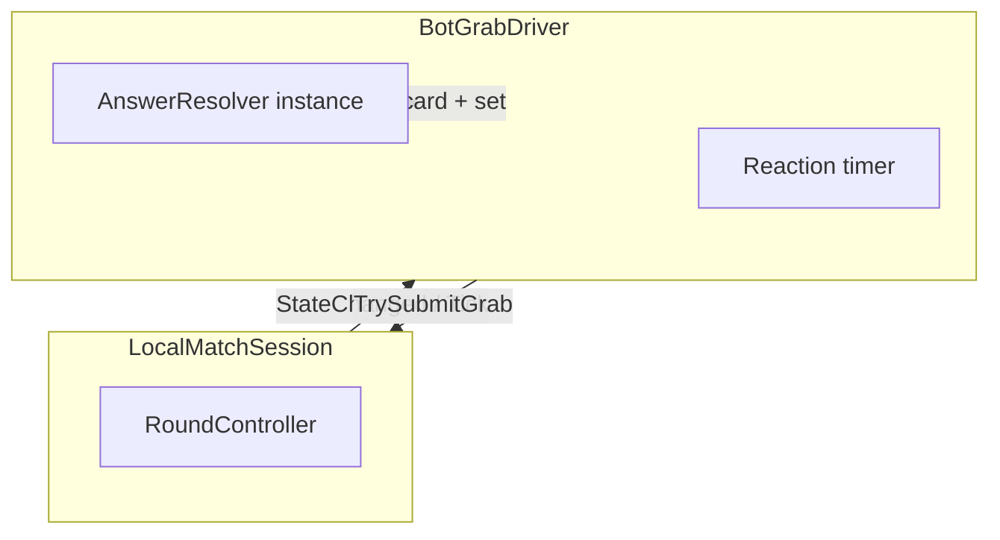

# Bots (modo offline)

## Contexto atual

- O loop de partida está em [`RoundController`](Assets/Scripts/Gameplay/Match/RoundController.cs): `TryRegisterGrab` aceita **um** grab por rodada na fase de grab; o primeiro registo consome o grab.
- [`LocalMatchSession`](Assets/Scripts/Gameplay/Match/LocalMatchSession.cs) expõe `Phase`, `CurrentCard`, `ActiveSet`, `StateChanged` e `TrySubmitGrab` via [`IMatchSession`](Assets/Scripts/Gameplay/Match/IMatchSession.cs), mas **não** expõe eventos explícitos de carta — o bot pode reagir a `StateChanged` ou a `Update`/`LateUpdate` consultando fase + carta.
- Não existe pasta `Gameplay/Bots/` nem integração com [`AnswerResolver`](Assets/Scripts/Core/AnswerResolver.cs).

## Objetivo

Um ou mais “bots” que, em partida **local** (`LocalMatchSession`), após um **atraso de reação** (derivado de dificuldade ou SO), chamam `TrySubmitGrab` com o slot correto (e opcionalmente errado para perfis “fracos”), competindo com o jogador humano pelo mesmo `TryRegisterGrab`.

## Desenho proposto

1. **`IAnswerResolver` / `AnswerResolver`** — o bot instancia ou recebe um resolver **puro** (igual ao do `RoundController`) e calcula `SoundObjectId` quando `CurrentCard` e `ActiveSet` estão definidos e `Phase == GrabPhase`.

2. **Componente `BotGrabDriver` (Gameplay)** — `MonoBehaviour` com referência serializada a `LocalMatchSession` (ou `FindAnyObjectByType`), mais parâmetros:
   - intervalo de atraso em segundos (min/max) ou referência futura a `DifficultyProfile`;
   - probabilidade de erro opcional;
   - “enabled only when no human grab yet” implícito: ao expirar o timer, se ainda `GrabPhase` e `TrySubmitGrab` retornar true, sucesso.

3. **Gatilho temporal** — em `StateChanged` (ou quando `Phase` passa a `GrabPhase`): reset do timer RNG dentro do intervalo; em `Update`, decrementar até zero e submeter. Se o humano já tiver ganho a fase (transição para `SpeakPhase`), não submeter.

4. **`MatchRules` / dificuldade** — fase mínima: campos opcionais em `MatchRules` ([`MatchModels.cs`](Assets/Scripts/Core/MatchModels.cs)) *ou* ScriptableObject `BotReactionProfile` só em Gameplay referenciado pelo driver — evitar inflar `Core` se não for necessário para NGO ainda.

5. **Testes** — EditMode: dado um `RoundController` em `GrabPhase` com carta/set fixos, simular passagem de tempo e `TryRegisterGrab` do bot e verificar que `RoundOutcome` reflete vitória do bot quando o humano não interage (pode exigir expor hooks de teste ou usar `LocalMatchSession` em PlayMode com `Time` mock — preferir teste no `RoundController` se for possível injetar tick sem Unity).

6. **Fora de âmbito imediato** — `NetMatchSession`: bots no servidor exigem simulação no host e política de “quem ganhou a carta”; documentar como extensão.

## Ficheiros principais a tocar

- Novo: `Assets/Scripts/Gameplay/Bots/BotGrabDriver.cs` (e opcionalmente `BotReactionProfile.cs`).
- Opcional: alargar [`MatchRules`](Assets/Scripts/Core/MatchModels.cs) ou manter tuning só no driver.
- Cena/prefab: adicionar `BotGrabDriver` ao mesmo fluxo que [`OfflineQuickStart`](Assets/Scripts/App/OfflineQuickStart.cs) (SampleScene ou cena de jogo futura).

## Critérios de pronto

- Com humano inativo, o bot marca pontos ao longo de várias rondas.
- Com humano ativo, o primeiro grab válido continua a determinar a transição (comportamento atual preservado).
- Nenhuma regressão em `OfflineGrabInputDriver`.
