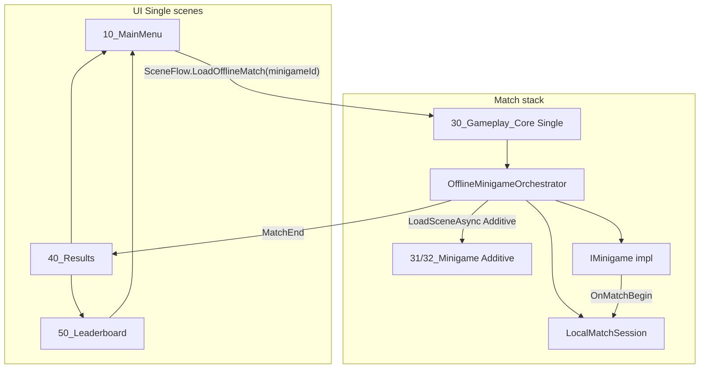

# Fluxo de cenas + IMinigame (blueprint, abordagem B)

## Contexto

**Fase 1 (concluída)** — plano original [`fluxo_cenas_mainmenu_b9aec075.plan.md`](.cursor/plans/fluxo_cenas_mainmenu_b9aec075.plan.md):

- Cenas UI: `10_MainMenu`, `40_Results`, `50_Leaderboard`
- Jogo monolítico: [`30_Gameplay_Offline.unity`](Assets/Scenes/30_Gameplay_Offline.unity) (cópia de SampleScene)
- [`SceneFlow`](Assets/Scripts/Gameplay/Navigation/SceneFlow.cs) / [`SceneNames`](Assets/Scripts/Gameplay/Navigation/SceneNames.cs) em `Blitz.Gameplay.Navigation`
- [`GameSessionPrefs`](Assets/Scripts/Core/GameSessionPrefs.cs) (nome, dificuldade, score)
- [`OfflineQuickStart`](Assets/Scripts/App/OfflineQuickStart.cs): `StartMatch` + `LoadResults` no `MatchEnd`
- Views ligadas a `SceneFlow` (menu, resultados, ranking)

**Gap vs** [`blitz_onomatopoeico_architecture_d4df416d.plan.md`](.cursor/plans/blitz_onomatopoeico_architecture_d4df416d.plan.md) §2 e §11:

| Blueprint | Hoje |
|-----------|------|
| `30_Gameplay_Core` + `31_Minigame_*` **aditivas** | Tudo numa cena `30_Gameplay_Offline` |
| `IMinigameLoader` / `MinigameRegistry` (SO) | `IMinigame` existe; **ninguém** chama o ciclo de vida |
| `MinigameDescriptor` | Não existe |
| `SceneFlow` só navega; match via minijogo | `OfflineQuickStart` ignora `IMinigame` |

Este plano descreve a **Fase 2 (abordagem B)**: core + cena aditiva + loader/orquestrador.



---

## 1. Reorganizar cenas (Editor)

**Objetivo:** separar sessão/HUD/input (core) de mesa/props/ambiente (minijogo).

| Cena | Conteúdo (mover desde `30_Gameplay_Offline`) |
|------|-----------------------------------------------|
| **`30_Gameplay_Core.unity`** (novo; pode renomear/refatorar `30_Gameplay_Offline`) | `LocalMatchSession`, `HUD` + `HudView`, `OfflineGrabInputDriver` (ou input do minijogo), câmara/luz base, opcional `NetworkBootstrap` futuro |
| **`31_Minigame_Blitz.unity`** (aditiva) | `TableRuntimeRegistry`, 3× `SoundObjectInstance`, layout Blitz, `BlitzOnomatopoeicoMinigame` |
| **`32_Minigame_Fantasma.unity`** (aditiva) | Variante de mesa + `FantasmaLadraoMinigame` |

- Manter `SampleScene.unity` só para dev rápido (opcional) ou apontar para core+blitz.
- **Build Settings** (ordem sugerida, índice 0 = menu):
  0. `10_MainMenu`
  1. `30_Gameplay_Core`
  2. `31_Minigame_Blitz`
  3. `32_Minigame_Fantasma`
  4. `40_Results`
  5. `50_Leaderboard`
  6. `SampleScene` (opcional)

**Opcional (blueprint):** `00_Bootstrap.unity` com serviços `DontDestroyOnLoad` (leaderboard JSON futuro) → carrega menu na 1ª frame; não bloqueia esta fase.

---

## 2. Dados de sessão e seleção no menu

Estender [`GameSessionPrefs`](Assets/Scripts/Core/GameSessionPrefs.cs):

- `SelectedMinigameId` (string, ex. `"blitz_ono"`, `"fantasma"`)

No menu ([`MainMenuView`](Assets/Scripts/UI/Views/MainMenuView.cs) / UXML):

- Dropdown ou botões para minijogo (fase mínima: 2 entradas fixas).
- `OnContinue`: gravar `PlayerName`, `DifficultyIndex`, **`SelectedMinigameId`**.

Regras/dificuldade → `MatchRules` + seed: ler `DifficultyIndex` no orquestrador (valores default aceitáveis na primeira entrega; tuning fino pode ficar para plano de bots/dificuldade).

---

## 3. `MinigameDescriptor` + catálogo (Core/Gameplay)

Conforme blueprint §3 / §10:

- **`MinigameDescriptor`** (`ScriptableObject`, `Assets/ScriptableObjects/Minigames/`):
  - `MinigameId` (string estável)
  - `AdditiveSceneName` (ex. `31_Minigame_Blitz`)
  - Metadados opcionais: display name, thumbnail
- **`MinigameCatalog`** (SO lista de descriptors) ou array num host — resolve `MinigameId` → descriptor.

Sem Addressables nesta fase; cenas devem estar na Build Settings.

---

## 4. `MinigameLoader` + `OfflineMinigameOrchestrator`

**Local:** `Assets/Scripts/Gameplay/Minigames/` (ou `Navigation/` se preferir agrupar com `SceneFlow`).

### `IMinigameLoader` (interface fina)

- `LoadAsync(MinigameDescriptor descriptor)` → `Scene` aditiva carregada
- `UnloadAsync()` → `SceneManager.UnloadSceneAsync`

### `OfflineMinigameOrchestrator` (`MonoBehaviour` na **Gameplay_Core**)

Responsabilidades (único dono do fluxo de partida offline):

1. **Entrada:** `Start()` ou chamado após core carregar — lê `GameSessionPrefs.SelectedMinigameId`, resolve descriptor, chama loader aditivo.
2. **`IMinigame`:** `GetComponentInChildren` / referência no descriptor para o `MonoBehaviour` que implementa [`IMinigame`](Assets/Scripts/Gameplay/Minigames/IMinigame.cs) na cena aditiva (ou prefab root na cena aditiva).
3. **Ciclo de vida** (ordem do blueprint §11):
   - `OnRegister(MinigameServices.Empty)` → `OnSceneLoaded()`
   - `OnMatchBegin(MatchConfig)` — minijogo chama `LocalMatchSession.StartMatch` (como [`BlitzOnomatopoeicoMinigame`](Assets/Scripts/Gameplay/Minigames/BlitzOnomatopoeicoMinigame.cs) já faz)
   - `OnRoundBegin` / `OnRoundEnd` — ver §5
   - `OnMatchEnd()` → `SceneFlow.LoadResults(session.Score)` → `OnUnregister()` + unload aditiva
4. **Substituir** [`OfflineQuickStart`](Assets/Scripts/App/OfflineQuickStart.cs): remover da cena core ou reduzir a wrapper que só delega no orquestrador (evitar dois `StartMatch`).

`SceneFlow` **não** implementa lógica de minijogo; apenas carrega o stack de match:

```csharp
// SceneFlow (evolução)
public static void LoadOfflineMatch(string minigameId) {
    PlayerPrefs.SetString(GameSessionPrefs.SelectedMinigameId, minigameId);
    SceneManager.LoadSceneAsync(SceneNames.GameplayCore, LoadSceneMode.Single);
    // Orchestrator on core Start loads additive scene from prefs/catalog
}
```

Alternativa equivalente: `LoadOfflineGame()` lê prefs já gravados pelo menu (comportamento atual + orquestrador).

---

## 5. Ponte `LocalMatchSession` → `IMinigame`

Hoje [`LocalMatchSession`](Assets/Scripts/Gameplay/Match/LocalMatchSession.cs) só expõe `StateChanged`; `CardPrepared` e `RoundResolved` estão no `RoundController` privado.

**Alteração mínima:**

- Expor em `IMatchSession` (ou interface `IMatchSessionEvents`):
  - `event Action<GeneratedCard> CardPrepared`
  - `event Action<RoundOutcome> RoundResolved`
- `LocalMatchSession` reencaminha os eventos do `_round`.

O orquestrador subscreve:

- `CardPrepared` + `ActiveSet` → `minigame.OnRoundBegin(card, set)`
- `RoundResolved` → `minigame.OnRoundEnd(outcome)`
- `StateChanged` quando `Phase == MatchEnd` → sequência fim (se ainda não tratado em `RoundResolved` da última rodada)

Garantir **uma** transição para resultados (flag `_matchEndHandled` como em `OfflineQuickStart`).

---

## 6. Input e Fantasma

- **Blitz:** manter [`OfflineGrabInputDriver`](Assets/Scripts/Gameplay/Input/OfflineGrabInputDriver.cs) na **core** ou na cena aditiva; deve encontrar `TableRuntimeRegistry` + `LocalMatchSession` via `FindAnyObjectByType` (já suportado).
- **Fantasma:** grab pode passar por [`FantasmaLadraoMinigame.TrySubmitWorldGrab`](Assets/Scripts/Gameplay/Minigames/FantasmaLadraoMinigame.cs); desativar driver genérico na variante Fantasma ou ramificar no driver conforme `SelectedMinigameId` (documentar no manual).

---

## 7. `SceneNames` e documentação

Atualizar [`SceneNames.cs`](Assets/Scripts/Gameplay/Navigation/SceneNames.cs):

- `GameplayCore = "30_Gameplay_Core"`
- `MinigameBlitz = "31_Minigame_Blitz"`
- `MinigameFantasma = "32_Minigame_Fantasma"`
- Deprecar/remover referência principal a `30_Gameplay_Offline` após migração.

Atualizar secção **Fluxo de cenas** em [`Docs/Manual-Programador.md`](Docs/Manual-Programador.md): diagrama core+aditiva, ordem Build Settings, prefs, orquestrador, extensão “novo minijogo” (novo SO + cena + entrada no catálogo).

---

## 8. Critérios de pronto (Fase 2)

- Menu → core → cena aditiva correta conforme minijogo escolhido.
- Partida inicia **só** via `IMinigame.OnMatchBegin` (sem `OfflineQuickStart` duplicado).
- Rodadas disparam `OnRoundBegin` / `OnRoundEnd` quando aplicável.
- Fim de partida: `OnMatchEnd` → resultados com score em prefs; unload da cena aditiva.
- Voltar ao menu desde resultados/leaderboard sem cena aditiva órfã na hierarquia.
- Trocar Blitz ↔ Fantasma no menu altera a cena aditiva na próxima entrada (sem editar core).

---

## 9. Fora de âmbito desta fase

- NGO / `NetMatchSession` com minijogos aditivos
- `MinigameServices` com áudio/spawner reais
- Lobby `20_Lobby.unity`
- Leaderboard JSON (plano separado)

---

## Ficheiros principais a criar/alterar

| Ação | Ficheiro |
|------|----------|
| Criar | `MinigameDescriptor.cs`, `MinigameCatalog.cs` |
| Criar | `MinigameLoader.cs`, `OfflineMinigameOrchestrator.cs` |
| Alterar | `SceneFlow.cs`, `SceneNames.cs`, `GameSessionPrefs.cs` |
| Alterar | `LocalMatchSession.cs`, `IMatchSession.cs` |
| Alterar | `MainMenuView.cs` (+ UXML se necessário) |
| Remover/desativar | `OfflineQuickStart` na cena core |
| Cenas | Split `30_Gameplay_Offline` → core + `31_*` / `32_*` |
| Config | `EditorBuildSettings.asset` |
