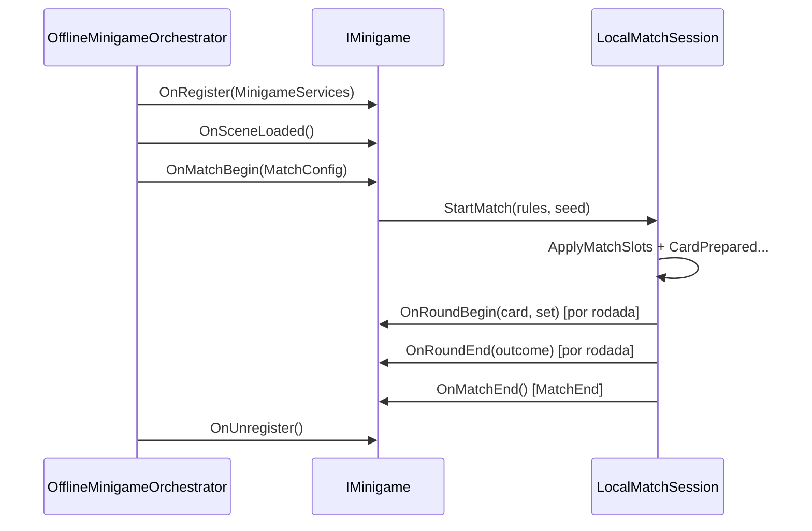

# Cronograma de integração — programador

Plano de **importação de assets** e **implementação dos hooks de `IMinigame`**, alinhado à [Lista de assets — artistas](Lista-Assets-Artistas.md) (checklist §9 e prioridades P0–P2).

**Público:** programação / tech art no Unity. **Pré-requisito:** [Manual do Programador](Manual-Programador.md) (orquestrador, mesa, UI).

---

## 1. Ciclo de vida `IMinigame` (referência)

O **`OfflineMinigameOrchestrator`** (cena `30_Gameplay_Core`) chama os hooks nesta ordem:

| Hook | Quem dispara | Uso típico (integração) |
|------|----------------|-------------------------|
| **`OnRegister`** | Orquestrador, após `MinigameServicesHost.Build` | Cachear `Audio`, `Input`, `Spawner`, `Players`; ligar referências serializadas |
| **`OnSceneLoaded`** | Após cena aditiva carregada | Resolver `TableRuntimeRegistry`, âncoras `Slot_0..2`, validar prefabs na cena |
| **`OnMatchBegin`** | Uma vez por partida | `session.StartMatch` (já no Blitz/Fantasma); aplicar skin de cena; spawn decor via `Spawner` |
| **`OnRoundBegin`** | `LocalMatchSession.CardPrepared` | Cue de áudio/VFX da carta, pulso nos props, animação de revelação no HUD/mundo |
| **`OnRoundEnd`** | `RoundResolved` | SFX/VFX acerto/erro; reset hover/outline |
| **`OnMatchEnd`** | `MatchPhase.MatchEnd` | Despawn temporários, parar loops, limpar feedback |
| **`OnUnregister`** | Destroy da core / unload | Libertar eventos, pools, referências ao saco de serviços |

**Estado atual no código:** `BlitzOnomatopoeicoMinigame` e `FantasmaLadraoMinigame` implementam `OnMatchBegin` → `StartMatch`; **`OnRoundBegin` / `OnRoundEnd` / `OnMatchEnd` estão vazios** — é onde entra a maior parte do polish por asset.

**Áudio da carta hoje:** `LocalMatchSession` toca o clip da cue em `CardPrepared` (antes do `OnRoundBegin` do minijogo). Hooks do minijogo devem **complementar** (VFX, UI, SFX de fase), não duplicar o cue salvo alinhamento explícito com `IAudioDirector`.

---

## 2. Mapa assets → hooks → arquivos

| # arte | Asset (lista artistas) | Hook principal | Tarefa programador | Onde no projeto |
|--------|------------------------|----------------|--------------------|-----------------|
| 1 | Figuras onomatopeia | `OnMatchBegin` (indireto) | Import PNG → SO `FigureSprite`; validar `ApplyFromDefinition` na mesa | `Assets/Art/Onomatopoeia/`, `OnomatopoeiaDefinition`, `SoundObjectInstance` |
| 2 | Som onomatopeia | — (sessão) | Ligar `AudioClip` nos SOs; testar trio sem clips repetidos | `OnomatopoeiaDefinition`, sampler |
| 3 | Labels / letras | — (HUD) | Conferir `WrittenLabel` / `LetterDisplay` nos SOs | `HudPresenter` (já lê SO) |
| 4 | Prefab `SoundObject_Base` | `OnSceneLoaded` | Montar prefab com collider + `SoundObjectInstance`; registrar slots na cena `31_*` | `Assets/Prefabs/Table/` |
| 5–7 | Mesa, âncoras, `TableLayoutRoot` | `OnSceneLoaded` | Posicionar `Slot_0..2` na cena aditiva; referenciar registry | `31_Minigame_Blitz.unity` |
| 8 | Moldura carta HUD | — (UI) | Sprites 9-slice / USS em `card-mount`; sem alterar `card-figure` | `HUD.uxml`, `Assets/Art/UI/` |
| 9 | SFX acerto/erro/UI | `OnRoundEnd`, UI views | Clips no `SessionAudioDirector` ou SO de feedback; menu/lobby nos presenters | `MinigameServicesHost`, views |
| 10 | Cenário Blitz | `OnMatchBegin` | Iluminação URP, fundo, decor não interativo | `31_Minigame_Blitz.unity` |
| 11–13 | VFX + shaders mesa | `OnRoundBegin` / `OnRoundEnd` | `GameplayFeedbackBus` + pool; outline em `SoundObjectInstance` | `Assets/Art/VFX/`, materiais |
| 14 | SFX fases | `OnRoundBegin`, `Tick` fase | Ouvir `IMatchSession.Phase` / `GrabTimeRemaining` | `RoundController` fases |
| 15–18 | UI menu/lobby/theme | Fora de `IMinigame` | Presenters + USS; não bloqueia minijogo | `Assets/UI Toolkit/` |
| 19 | VFX HUD | `OnRoundEnd` | Flash `card-mount`, toast no bus | `HudPresenter` + bus |
| 20–22 | Resultados, catálogo, música | `OnMatchEnd` / fluxo cenas | `SceneFlow.LoadResults`; expandir catálogo | SOs, `40_Results` |
| 23–28 | Fantasma *(opcional)* | Mesmos hooks | Segunda cena `32_*`, `TrySubmitWorldGrab`, adapter | `FantasmaLadraoMinigame` |

---

## 3. Cronograma por fase (sugerido)

Ajuste **datas** e **responsável** conforme a equipe. A coluna **Arte (#)** referencia o checklist em [Lista-Assets-Artistas §9](Lista-Assets-Artistas.md#9-checklist-de-produção).

### Fase A — Playtest jogável (P0) — ~1–2 semanas

**Objetivo:** partida offline com 3+ onomatopeias reais, mesa clicável, HUD legível, feedback mínimo de acerto/erro.

| Semana | Entrega programador | Hooks `IMinigame` | Depende de arte (#) | Responsável | Data |
|--------|---------------------|-------------------|---------------------|-------------|------|
| A1 | Importar lote MVP: SOs com sprite + áudio + labels | — (dados) | 1, 2, 3 | | |
| A1 | Cena `31_Minigame_Blitz`: 3× prefab prop nos slots + `TableRuntimeRegistry` | `OnSceneLoaded` | 4, 5, 6, 7 | | |
| A1 | Validar `ApplyMatchSlots` após `OnMatchBegin` (figuras na mesa) | `OnMatchBegin` | 1, 4 | | |
| A2 | HUD: moldura `card-mount` (USS/sprites); smoke `HudPresenter` + figuras | — | 8 | | |
| A2 | SFX: acerto/erro rodada + clique UI (não duplicar cue da carta) | `OnRoundEnd` | 9 | | |
| A2 | Smoke test: menu → core → Blitz → 1 partida completa → resultados | todos (smoke) | 1–9 | | |

**Definition of done (Fase A)**

- [ ] `OnomatopoeiaCatalog` com ≥3 entradas completas no Inspector da core.
- [ ] Grab na mesa registra slot correto; sprites distintos nos 3 props.
- [ ] HUD mostra letra, figura (`card-figure`), cue e prompt.
- [ ] `OnRoundEnd`: pelo menos SFX ou toast para acerto/erro.
- [ ] `BlitzOnomatopoeicoMinigame`: `OnSceneLoaded` valida registry (log claro se faltar slot).

---

### Fase B — Polish de partida (P1) — ~2–3 semanas

**Objetivo:** feedback de interação na mesa, ritmo de rodada audível/visível, identidade visual fora do minijogo.

| Semana | Entrega programador | Hooks `IMinigame` | Depende de arte (#) | Responsável | Data |
|--------|---------------------|-------------------|---------------------|-------------|------|
| B1 | Cenário Blitz: luz, fundo, decor (sem quebrar raycast) | `OnMatchBegin` | 10 | | |
| B1 | `OnRoundBegin`: entrada carta / pulso grab (VFX ou anim UI) | `OnRoundBegin` | 11, 12, 14 | | |
| B1 | Hover/outline no prop (`GrabPhase`); desligar em `OnRoundEnd` | `OnRoundBegin` / fase | 11, 13 | | |
| B2 | `OnRoundEnd`: burst acerto/erro mesa + flash HUD | `OnRoundEnd` | 11, 19 | | |
| B2 | SFX timer + transições de fase (escutar `Phase`) | `OnRoundBegin`, tick | 14 | | |
| B2–B3 | Menu + lobby: sprites/USS nos presenters | — | 15, 16, 17, 18 | | |
| B3 | Integrar `GameplayFeedbackBus` (toasts, hooks testáveis) | `OnRoundEnd` | 19 | | |

**Definition of done (Fase B)**

- [ ] Jogador percebe início de grab (VFX ou SFX).
- [ ] Hover visível só em `GrabPhase`.
- [ ] Acerto/erro com feedback mesa + HUD.
- [ ] Menu e lobby com arte aplicada (sem placeholder cinza).

---

### Fase C — Escala e conteúdo (P2) — ~2+ semanas

| Semana | Entrega programador | Hooks `IMinigame` | Depende de arte (#) | Responsável | Data |
|--------|---------------------|-------------------|---------------------|-------------|------|
| C1 | Expandir catálogo (>3); pipeline de import em lote | `OnMatchBegin` | 21 | | |
| C1 | Telas resultados + ranking ilustradas | `OnMatchEnd` → fluxo | 20 | | |
| C2 | Música ambiente (menu / gameplay / resultados) | `OnMatchBegin` / `OnMatchEnd` | 22 | | |
| C2 | *(Opcional)* Fantasma: cena `32_*`, letras 3D, `FantasmaWorldGrabInput` | todos | 23–28 | | |

**Definition of done (Fase C)**

- [ ] Partidas com sorteio de biblioteca grande sem repetição de sprite/áudio no trio.
- [ ] Fluxo pós-partida com arte de resultados/ranking.
- [ ] *(Opcional)* Fantasma jogável com mesmo ciclo de hooks que o Blitz.

---

## 4. Checklist de integração (programador)

Marcar quando o asset estiver **importado**, **referenciado** (SO/prefab/cena) e **validado em play mode**. Colunas em branco para preencher na equipe.

| # | Integração | Hook / sistema | Arte (#) | Prioridade | Responsável | Data | OK |
|---|------------|----------------|----------|------------|-------------|------|-----|
| I1 | SOs onomatopeia (sprite + áudio + labels) | Dados / `ApplyFromDefinition` | 1–3 | P0 | | | ☐ |
| I2 | Prefab prop + colliders na cena Blitz | `OnSceneLoaded` | 4 | P0 | | | ☐ |
| I3 | Mesa + âncoras + `TableLayoutRoot` | `OnSceneLoaded` | 5–7 | P0 | | | ☐ |
| I4 | `TableRuntimeRegistry.ApplyMatchSlots` smoke | `OnMatchBegin` | 1, 4 | P0 | | | ☐ |
| I5 | Moldura HUD (`card-mount`, não `card-figure`) | UI / `HudPresenter` | 8 | P0 | | | ☐ |
| I6 | SFX acerto/erro + UI click | `OnRoundEnd` / views | 9 | P0 | | | ☐ |
| I7 | `OnSceneLoaded`: validação de slots (logs/assert) | `OnSceneLoaded` | 4–7 | P0 | | | ☐ |
| I8 | Cenário `31_Minigame_Blitz` completo | `OnMatchBegin` | 10 | P1 | | | ☐ |
| I9 | `OnRoundBegin`: VFX/SFX entrada carta + pulso grab | `OnRoundBegin` | 11, 12, 14 | P1 | | | ☐ |
| I10 | Hover/outline props em `GrabPhase` | fase + `OnRoundEnd` reset | 11, 13 | P1 | | | ☐ |
| I11 | `OnRoundEnd`: VFX mesa + flash HUD + bus | `OnRoundEnd` | 11, 19 | P1 | | | ☐ |
| I12 | Menu + lobby + theme USS/fontes | Presenters | 15–18 | P1 | | | ☐ |
| I13 | Catálogo expandido + testes sampler | `OnMatchBegin` | 21 | P2 | | | ☐ |
| I14 | Resultados + ranking | `SceneFlow` / views | 20 | P2 | | | ☐ |
| I15 | Música ambiente | `OnMatchBegin` / `OnMatchEnd` | 22 | P2 | | | ☐ |
| I16 | *(Opcional)* Fantasma: cena + `TrySubmitWorldGrab` + hooks | todos | 23–28 | P2 | | | ☐ |

---

## 5. Implementação sugerida nos minijogos (Blitz)

Ponto de partida: `Assets/Scripts/Gameplay/Minigames/BlitzOnomatopoeicoMinigame.cs`.

| Hook | Ação recomendada |
|------|------------------|
| `OnRegister` | Guardar `MinigameServices`; opcional: referência a `TableRuntimeRegistry` serializada ou cache em `OnSceneLoaded` |
| `OnSceneLoaded` | `Find` registry; verificar 3 slots; desabilitar decor sem collider de grab |
| `OnMatchBegin` | Já chama `StartMatch`; opcional: `Spawner` para props decor; não reimplementar `ApplyMatchSlots` (sessão já faz) |
| `OnRoundBegin` | Ler `card` + `set`; tocar SFX de fase via `_services.Audio`; spawn VFX entrada; sinalizar props (evento ou componente em slot) |
| `OnRoundEnd` | Branch `outcome` → SFX/VFX acerto/erro; `GameplayFeedbackBus.RaiseToast` |
| `OnMatchEnd` | Parar coroutines/particles; devolver materiais default nos props |
| `OnUnregister` | Unsubscribe de eventos locais |

**Fantasma (opcional):** mesmo esqueleto; grab via `TrySubmitWorldGrab` + `FantasmaWorldGrabInput` na cena `32_*`; `OnRegister` com `UseBlitzGrabDriver = false` no descriptor.

---

## 6. Sincronização com a arte

| Evento | Ação programador |
|--------|------------------|
| Arte entrega PNGs + WAV (P0) | Import, criar/atualizar SOs, commit em `Assets/Art/` e `Assets/Audio/` |
| Arte entrega prefab/cena | Abrir cena aditiva, substituir placeholders, revalidar colliders |
| Arte entrega UI | Aplicar em `Assets/Art/UI/`, atualizar USS; rodar uma partida no HUD |
| Mudança de nomes UXML | Não renomear `card-letter`, `card-figure`, `card-cue`, `prompt` sem atualizar presenters |

Consultar convenções de path: [Lista-Assets-Artistas §8](Lista-Assets-Artistas.md#8-convenções-de-handoff).

---

## 7. Testes mínimos por fase

| Fase | Teste |
|------|--------|
| A | Play Mode: 1 partida Blitz, 3 grabs corretos/incorretos, HUD atualiza, resultados abrem |
| B | GrabPhase: hover só ativo na janela; timer audível no fim; acerto/erro visíveis |
| C | 10+ partidas com seeds diferentes sem clip/sprite repetido no trio; *(opcional)* troca minijogo Fantasma no menu |

EditMode existente: `AnswerResolverTests` — não substitui smoke de integração visual.

---

## 8. Referências

- [Lista de assets — artistas](Lista-Assets-Artistas.md)  
- [Manual do Programador](Manual-Programador.md) — §3 fluxo core + §6 novo minijogo  
- [Manual de ScriptableObjects](Manual-ScriptableObjects.md) — catálogo e descriptors  
- [Manual do Designer](Manual-Designer.md) — montagem de cena e prefabs  
- Blueprint: `.cursor/plans/blitz_onomatopoeico_architecture_d4df416d.plan.md` (§11 `IMinigame`)
