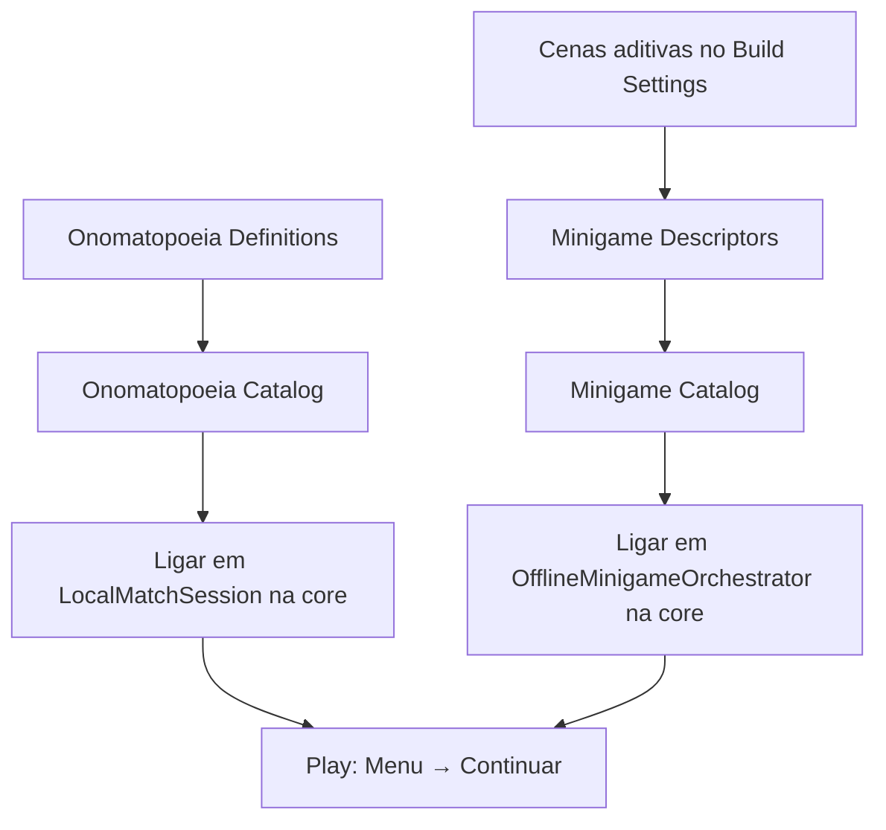

# Manual — ScriptableObjects (Blitz)

Guia para **criar e ligar** os ScriptableObjects (SO) usados pelo jogo no Unity. Não é preciso editar C#: tudo passa pelo menu **Create → Blitz** e pelo Inspector.

## Para quem é este manual

| Papel | O que vai fazer aqui |
|--------|----------------------|
| **Designer / conteúdo** | Criar definições de onomatopeia (sprite, áudio, rótulos) e o catálogo de conteúdo |
| **Game designer** | Configurar minijogos (IDs, cenas aditivas, grab Blitz vs Fantasma) |
| **Programador** | Validar wiring na cena core e alinhar IDs com `MinigameIds` / menu |

Índice geral: [README dos Docs](README.md).

---

## 1. Onde guardar os assets

| Tipo | Pasta sugerida | Já existe no repo? |
|------|----------------|------------------|
| Onomatopeia (uma entrada) | `Assets/ScriptableObjects/Sounds/` ou subpastas por letra | Pasta reservada (`.gitkeep`) |
| Catálogo de onomatopeias | `Assets/ScriptableObjects/Sounds/OnomatopoeiaCatalog.asset` | Criar quando houver conteúdo |
| Descriptor de minijogo | `Assets/ScriptableObjects/Minigames/` | Sim (`BlitzOnomatopoeico.asset`, `FantasmaLadrao.asset`) |
| Catálogo de minijogos | `Assets/ScriptableObjects/Minigames/MinigameCatalog.asset` | Sim |
| Perfil de dificuldade | `Assets/ScriptableObjects/Difficulty/` | Criar via menu **Blitz → Setup Difficulty Catalog** |
| Catálogo de dificuldades | `Assets/ScriptableObjects/Difficulty/DifficultyCatalog.asset` | Idem |

**Regra:** mantenha os `.asset` versionados no Git. Não renomeie arquivos à toa no Explorer — o Unity usa o GUID do `.meta` para referências na cena.

---

## 2. Como criar qualquer SO do projeto

1. No **Project**, clique com o botão direito na pasta de destino (ex.: `Assets/ScriptableObjects/Minigames/`).
2. **Create → Blitz →** escolha o tipo (ver tabela abaixo).
3. Dê um nome claro ao arquivo (ex.: `Onomatopoeia_Chao`, `MinigameCatalog`).
4. Preencha os campos no **Inspector**.
5. Se o SO for uma **lista** (catálogo), arraste os filhos para o array **Definitions** ou **Entries**.

| Menu Create → Blitz | Classe | Uso |
|---------------------|--------|-----|
| **Onomatopoeia Definition** | `OnomatopoeiaDefinition` | Uma onomatopeia (letra, figura, áudio) |
| **Onomatopoeia Catalog** | `OnomatopoeiaCatalog` | Lista de definições sorteadas por partida |
| **Minigame Descriptor** | `MinigameDescriptor` | Um minijogo (ID + cena aditiva) |
| **Minigame Catalog** | `MinigameCatalog` | Lista de descriptors para o orquestrador |
| **Difficulty Profile** | `DifficultyProfile` | Rodadas, janela de grab, offset de seed, nome no menu |
| **Difficulty Catalog** | `DifficultyCatalog` | Lista de perfis para menu + orquestrador |

Se o submenu **Blitz** não aparecer, espere a compilação de scripts terminar ou abra **Assets → Open C# Project** e corrija erros no Console.

---

## 3. Conteúdo: Onomatopoeia

### 3.1 `Onomatopoeia Definition` (uma entrada)

Cada asset descreve **uma** onomatopeia ensinada na partida (figura + som + letra associada).

| Campo (Inspector) | Significado | Dica |
|-------------------|-------------|------|
| **Id** | Identificador numérico (`byte`) | Deve ser **único** entre todas as definições do catálogo |
| **Letter Value** | Valor da letra (`byte`) | Três letras **diferentes** são sorteadas por partida; evite repetir a mesma letra em entradas que entram no mesmo pool |
| **Figure Visual Id** | ID visual opcional | Para VFX/UI futuros |
| **Figure Sprite** | Sprite da figura na mesa/HUD | Arraste de `Assets/Art/` |
| **Letter Display** | Texto curto na UI | Se vazio, usa o byte da letra como string |
| **Written Label** | Rótulo escrito (ex.: “Toc”) | HUD / carta |
| **Audio Clip** | Som da onomatopeia | Arraste de `Assets/Audio/`; usado na cue da carta |

**Passo a passo — nova onomatopeia**

1. **Create → Blitz → Onomatopoeia Definition** em `Assets/ScriptableObjects/Sounds/`.
2. Defina **Id** (ex.: `1`, `2`, `3`… sem duplicar).
3. Defina **Letter Value** (ex.: ASCII da letra ou convenção da equipe — o importante é **três letras distintas** no trio sorteado).
4. Arraste **Figure Sprite** e **Audio Clip**.
5. Preencha **Written Label** (e **Letter Display** se quiser texto customizado).

### 3.2 `Onomatopoeia Catalog`

Agrupa todas as `Onomatopoeia Definition` que podem entrar numa partida.

| Campo | Significado |
|-------|-------------|
| **Definitions** | Lista de referências para assets `Onomatopoeia Definition` |

**Requisitos para o sorteio funcionar** (ver `OnomatopoeiaMatchSampler`):

- Pelo menos **3** definições não nulas na lista.
- É possível escolher **3 entradas com letras diferentes** (senão o jogo cai no conjunto sintético de dev).
- Cada trio sorteado precisa de **`Figure Sprite` e `Audio Clip` distintos** entre si (o sampler rejeita duplicados — ex.: J e C não podem partilhar o mesmo sprite).

**Passo a passo — catálogo**

1. Crie várias **Onomatopoeia Definition** (mínimo 3, com letras distintas).
2. **Create → Blitz → Onomatopoeia Catalog** (ex.: `OnomatopoeiaCatalog.asset`).
3. No array **Definitions**, defina o **Size** e arraste cada definition.
4. Na cena **`30_Gameplay_Core`**, no GameObject **LocalMatch**:
   - Componente **Local Match Session**
   - Campo **Onomatopoeia Catalog** → arraste o catálogo.

Se o catálogo estiver vazio ou inválido, a partida ainda corre com dados **sintéticos de desenvolvimento** (sem sprites/áudio reais).

---

## 4. Minijogos: Descriptor + Catalog

O fluxo offline usa **cena core** + **cena aditiva** por minijogo. Os SO dizem ao `OfflineMinigameOrchestrator` qual cena carregar.

### 4.1 IDs estáveis (importante)

Estes valores devem coincidir com o **menu** e com o código:

| Minijogo | `MinigameId` (copiar exatamente) | Cena aditiva (nome no Build Settings) |
|----------|----------------------------------|----------------------------------------|
| Blitz Onomatopoeico | `blitz_ono` | `31_Minigame_Blitz` |
| Fantasma Ladrão | `fantasma` | `32_Minigame_Fantasma` |

Constantes em código: `Assets/Scripts/Core/MinigameIds.cs`.  
O menu usa a mesma lista em `MainMenuViewModel.MinigameIds`.

**Novo minijogo:** além do SO, é preciso atualizar o menu (lista no ViewModel) e o código se introduzir um ID novo.

### 4.2 `Minigame Descriptor` (um minijogo)

| Campo | Significado |
|-------|-------------|
| **Minigame Id** | String estável (ex.: `blitz_ono`) — gravada em `PlayerPrefs` pelo menu |
| **Additive Scene Name** | Nome da cena **sem** `.unity`, igual ao arquivo em `Assets/Scenes/` e no Build Settings |
| **Display Name** | Nome legível (UI / debug) |
| **Use Blitz Grab Driver** | `true`: grab na **core** (`OfflineGrabInputDriver`). `false`: grab no minijogo (Fantasma usa `FantasmaWorldGrabInput`) |

**Passo a passo — novo descriptor**

1. Crie a cena aditiva `Assets/Scenes/3x_Minigame_<Nome>.unity` (mesa + componente `IMinigame`).
2. Adicione a cena em **File → Build Settings** (após `30_Gameplay_Core`).
3. **Create → Blitz → Minigame Descriptor** em `Assets/ScriptableObjects/Minigames/`.
4. Preencha **Minigame Id**, **Additive Scene Name**, **Display Name**, **Use Blitz Grab Driver**.
5. Registe o descriptor no catálogo (secção seguinte).

**Exemplo já no repositório** (`BlitzOnomatopoeico.asset`):

- Minigame Id: `blitz_ono`
- Additive Scene Name: `31_Minigame_Blitz`
- Use Blitz Grab Driver: ligado

### 4.3 `Minigame Catalog`

| Campo | Significado |
|-------|-------------|
| **Entries** | Lista de `Minigame Descriptor` |

**Passo a passo — catálogo**

1. Tenha um descriptor por minijogo jogável.
2. **Create → Blitz → Minigame Catalog** (ou use `Assets/ScriptableObjects/Minigames/MinigameCatalog.asset`).
3. Em **Entries**, arraste `BlitzOnomatopoeico`, `FantasmaLadrao`, etc.
4. Na cena **`30_Gameplay_Core`**, GameObject **LocalMatch**:
   - **Offline Minigame Orchestrator** → **Catalog** → arraste `MinigameCatalog`.

**Atalho no Editor:** menu **Blitz → Setup Gameplay Scenes (Core + Additive)** recria cenas e pode repopular o catálogo (útil após clonar o repo).

---

## 5. Ordem recomendada de configuração

1. Conteúdo sonoro/visual → catálogo de onomatopeias → **LocalMatchSession**.
2. Cenas de minijogo no build → descriptors → **MinigameCatalog** → **OfflineMinigameOrchestrator**.
3. Testar no menu com cada entrada do dropdown **Minijogo**.

---

## 6. Checklist antes de dar Play

- [ ] **Build Settings** inclui `10_MainMenu`, `30_Gameplay_Core`, `31_Minigame_Blitz`, `32_Minigame_Fantasma`, `40_Results`, `50_Leaderboard`.
- [ ] **MinigameCatalog** referenciado no orquestrador da cena core.
- [ ] Cada **Minigame Id** do catálogo existe no menu (ou só teste os que estão no dropdown).
- [ ] **Additive Scene Name** coincide com o nome do arquivo de cena.
- [ ] (Opcional) **OnomatopoeiaCatalog** na sessão com ≥ 3 definições e 3 letras distintas possíveis.
- [ ] Cena aditiva tem um `IMinigame` na hierarquia (ex.: `BlitzOnomatopoeicoMinigame` no root da mesa).

---

## 7. Problemas comuns

| Sintoma | Causa provável | Solução |
|---------|----------------|---------|
| `unknown minigame id` no Console | Id do menu ≠ id do descriptor | Alinhar com `MinigameIds` / prefs `SelectedMinigameId` |
| Cena aditiva não carrega | Nome errado ou cena fora do build | Corrigir **Additive Scene Name** e Build Settings |
| Sem som/figura na partida | Catálogo de onomatopeias vazio | Preencher **Onomatopoeia Catalog** ou aceitar modo dev sintético |
| Grab não funciona (Blitz) | `Use Blitz Grab Driver` desligado ou sem mesa na cena aditiva | Ligar flag; conferir `TableRuntimeRegistry` na cena `31_*` |
| Grab não funciona (Fantasma) | Driver Blitz ainda ativo ou falta `FantasmaWorldGrabInput` | Descriptor com **Use Blitz Grab Driver** = off; componente na cena `32_*` |
| Submenu Blitz não aparece | Erros de compilação | Corrigir Console; recompilar |

---

## 8. Dificuldade

1. No Unity: **Blitz → Setup Difficulty Catalog** (cria `DifficultyEasy/Medium/Hard` + `DifficultyCatalog.asset` e liga às cenas menu e core).
2. Ou manualmente: **Create → Blitz → Difficulty Profile** (um asset por nível) e **Difficulty Catalog** com três entradas na ordem do dropdown.
3. Campos do perfil:
   - **Difficulty Id** — `easy`, `medium`, `hard` (deve coincidir com `DifficultyIds` no código).
   - **Display Name** — texto no menu (ex.: Fácil).
   - **Total Rounds** — número de cartas na partida (máx. 9).
   - **Grab Window Seconds** — tempo para agarrar o objeto.
   - **Match Seed Offset** — somado ao seed base do orquestrador (varia o trio sorteado).
4. Arraste **Difficulty Catalog** para:
   - **Main Menu View** → **Difficulty Catalog**
   - **Offline Minigame Orchestrator** → **Difficulty Catalog**

O menu grava `SelectedDifficultyId` em `PlayerPrefs`; o orquestrador resolve `MatchRules` via `DifficultyProfile.ToMatchRules()`.

---

## 9. Pastas reservadas (futuro)

- `Assets/ScriptableObjects/Letters/`
- `Assets/ScriptableObjects/Bots/`

---

## 10. Referências no código

| SO | Script |
|----|--------|
| Onomatopoeia Definition / Catalog | `Assets/Scripts/Gameplay/Content/` |
| Difficulty Profile / Catalog | `Assets/Scripts/Gameplay/Content/` |
| Minigame Descriptor / Catalog | `Assets/Scripts/Gameplay/Minigames/` |
| Sorteio do trio | `OnomatopoeiaMatchSampler.cs` |
| Consumo na partida | `LocalMatchSession.cs`, `OfflineMinigameOrchestrator.cs` |

Mais contexto de arquitetura: [Manual do Programador](Manual-Programador.md) (fluxo core + aditiva, minijogos).
