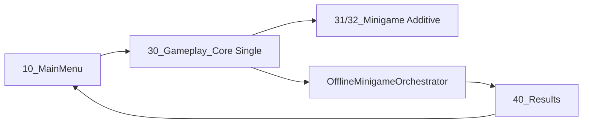

# Manual do Programador

Arquitetura **Blitz** em assemblies, fluxo de **match/rodada**, **UI** desacoplada, **NGO** e **testes**. Convenção de namespaces: `Blitz.*`.

## 1. Assemblies (`asmdef`) e dependências

| Assembly | Arquivo | Referências principais | Responsabilidade |
|----------|---------|------------------------|------------------|
| **Blitz.Core** | `Assets/Scripts/Core/Blitz.Core.asmdef` | Nenhuma (sem `UnityEngine`) | DTOs, regras puras, RNG/contratos, interfaces sem MonoBehaviour |
| **Blitz.Gameplay** | `Assets/Scripts/Gameplay/Blitz.Gameplay.asmdef` | `Blitz.Core`, `Unity.InputSystem` | MonoBehaviours, mesa, input de grab, sessão offline, minijogos, host do lobby |
| **Blitz.UI** | `Assets/Scripts/UI/Blitz.UI.asmdef` | `Blitz.Core`, `Blitz.Gameplay` | UI Toolkit views/presenters/viewmodels — não chame `Physics.Raycast` daqui |
| **Blitz.Netcode** | `Assets/Scripts/Networking/NGO/Blitz.Netcode.asmdef` | `Blitz.Core`, `Blitz.Gameplay`, `Unity.Netcode.Runtime`, `Unity.Netcode.GameObjects` | `NetworkBehaviour`, RPCs, variáveis replicadas |
| **Blitz.App** | `Assets/Scripts/App/Blitz.App.asmdef` | `Blitz.Core`, `Blitz.Gameplay`, `Blitz.UI`, `Blitz.Netcode` | Composição legada (`OfflineQuickStart`; preferir orquestrador na core) |

**Direção permitida:** `Core` ← ninguém de “jogo”; `Gameplay` → `Core`; `UI` → `Core` + `Gameplay` (para `IMatchSession`, etc.); `Netcode` → `Core` + `Gameplay` + pacotes NGO; `App` → todos.

**Evite:** referenciar `Blitz.UI` ou `Blitz.Netcode` a partir de `Blitz.Core` (quebra a separação).

## 2. Domínio de cartas e mesa (`Blitz.Core`)

Arquivos-chave em `Assets/Scripts/Core/`:

- **`Identifiers.cs`** — `LetterId`, `OnomatopoeiaId`, `SoundObjectId` (slot 0–2).
- **`CardModels.cs`** — `GeneratedCard`, `CardMode` (`HasTruePair` vs `ExclusionMismatch`), `CardPresentationPair` (figura + `CueOnomatopoeiaId`).
- **`ActiveOnomatopoeiaSet.cs`** — três letras com `T(L)` (onomatopeia ensinada), permutação das três unidades nos slots da mesa.
- **`AnswerResolver.cs`** / **`IAnswerResolver.cs`** — resposta canônica para `(carta, mesa)`.
- **`CardGenerator.cs`** — gera **carta** para um `ActiveOnomatopoeiaSet` já fixo na partida (retries internos).
- **`CardUniqueness.cs`** — invariantes de unicidade (usado pelo gerador e pelos testes).
- **`MatchModels.cs`** — `MatchRules`, `MatchPhase`, `RoundOutcome`.
- **`GameSessionPrefs.cs`** — chaves `PlayerPrefs` partilhadas entre cenas (`PlayerName`, `SelectedDifficultyId`, `SelectedMinigameId`, `PendingResultsScore`; `DifficultyIndex` legado).
- **`MinigameIds.cs`** / **`DifficultyIds.cs`** — identificadores estáveis para prefs e SOs (`easy`, `medium`, `hard`).
- **`DifficultyProfile`**, **`DifficultyCatalog`** — rodadas, grab window, seed offset; ver [Manual de ScriptableObjects](Manual-ScriptableObjects.md) §8.
- **Lobby (contrato + stub)** — `ILobbyService`, `LobbyServiceStub`, modelos de seat em `Assets/Scripts/Core/`.

### Testes EditMode

- Assembly: `Assets/Tests/EditMode/Core/Blitz.Core.Tests.asmdef`
- Exemplo: `AnswerResolverTests.cs` — cobre positivo, exclusão e propriedades do gerador em várias seeds.

Rodar no Unity: **Window → General → Test Runner → EditMode**.

## 3. Sessão e rodadas (`Blitz.Gameplay`)

### Contrato

- **`IMatchSession`** (`Assets/Scripts/Gameplay/Match/IMatchSession.cs`) — fase, pontos, carta ativa, conjunto ativo (`ActiveOnomatopoeiaSet`), `TrySubmitGrab`, `Tick`, eventos `StateChanged`, `CardPrepared`, `RoundResolved`; `StartMatch(rules, seed)` ou `StartMatch(rules, activeSet, cardGenSeed)`.

### Implementação offline

- **`LocalMatchSession`** — `MonoBehaviour` + `Update` chama `Tick`; delega em `RoundController`. Opcional: **`OnomatopoeiaCatalog`** no Inspector — sorteia três definições por partida; se vazio ou inválido, usa conjunto sintético de dev (`ActiveOnomatopoeiaSet.CreateSyntheticDevSet`).
- **`RoundController`** — máquina de estados por fase (`MatchInit` → … → `MatchEnd`); **define o trio de onomatopeias no início da partida** (`BeginMatch` recebe `ActiveOnomatopoeiaSet`); cada rodada só gera **carta** via `CardGenerator.TryGenerateCard`; resolve com `AnswerResolver`; dispara `RoundResolved`.

### Conteúdo (ScriptableObjects)

- **`OnomatopoeiaDefinition`**, **`OnomatopoeiaCatalog`**, **`OnomatopoeiaMatchSampler`** — `Assets/Scripts/Gameplay/Content/`.

### Mesa e grab

- **`TableRuntimeRegistry`** — registro de `SoundObjectInstance`, `TryRaycastGrab(Camera, screenPos, out SoundObjectId)`; **`ApplyMatchSlots`** aplica os três SOs da partida aos slots.
- **`SoundObjectInstance`** — `slotIndex` 0–2; `OnEnable` registra no registry; opcional **`SpriteRenderer`** (`figureRenderer`) preenchido por `ApplyFromDefinition` quando há `OnomatopoeiaDefinition` no slot.
- **`OfflineGrabInputDriver`** (cena **core**) — `GrabPhase` + clique esquerdo + raycast na mesa aditiva + `TrySubmitGrab`. Ativo só quando o descriptor tem `UseBlitzGrabDriver` (Blitz).
- **`FantasmaWorldGrabInput`** (cena **Fantasma** aditiva) — raycast local + `FantasmaLadraoMinigame.TrySubmitWorldGrab` → `IInputRouter` (com `ISolutionSpaceAdapter`).

### Fluxo de cenas (offline, core + aditiva)

- **`SceneNames`** / **`SceneFlow`** (`Assets/Scripts/Gameplay/Navigation/`) — `LoadOfflineGame()` carrega a core; o menu grava `SelectedMinigameId` antes de continuar. `LoadOfflineMatch(minigameId)` opcional para forçar o minijogo.
- **Build Settings** — ordem no **File → Build Settings** (índice 0 = menu):
  0. `Assets/Scenes/10_MainMenu.unity`
  1. `Assets/Scenes/30_Gameplay_Core.unity`
  2. `Assets/Scenes/31_Minigame_Blitz.unity`
  3. `Assets/Scenes/32_Minigame_Fantasma.unity`
  4. `Assets/Scenes/40_Results.unity`
  5. `Assets/Scenes/50_Leaderboard.unity`
  6. `Assets/Scenes/SampleScene.unity` (opcional)
- **`OfflineMinigameOrchestrator`** — na core: lê prefs + `MinigameCatalog`, carrega cena aditiva, `OnRegister(MinigameServices)`, ciclo `IMinigame`, fim → `LoadResults`.
- **`MinigameServicesHost`** — monta o saco (`IAudioDirector`, `IInputRouter`, `IPrefabSpawner`, `IPlayerVisualRegistry`) antes de `OnSceneLoaded`.
- **`30_Gameplay_Offline.unity`** — legado monolítico; preferir core + aditiva. Menu **Blitz → Setup Gameplay Scenes** regenera cenas se necessário.
- **Resultados → ranking → menu:** `40_Results` (`to-leaderboard` → `LoadLeaderboard`) → `50_Leaderboard` (`back` → `LoadMainMenu`).

### Ranking / leaderboard (JSON local)

- **`LeaderboardEntry`**, **`ILeaderboardRepository`**, **`LeaderboardConstants.DefaultTopCount` (20)** — `Assets/Scripts/Core/`.
- **`LeaderboardServices.Register` / `TryGetRepository`** — registo estático para **UI** e **Gameplay** sem referenciar `Blitz.App`.
- **`JsonLeaderboardRepository`** (`Blitz.App`) — ficheiro `Application.persistentDataPath/leaderboard.json`, wrapper `{ "Entries": [...] }` via `JsonUtility`.
- **`LeaderboardBootstrap`** — regista o repositório no arranque (`RuntimeInitializeOnLoadMethod` + opcional GO na cena `10_MainMenu`; menu editor **Blitz → Setup Leaderboard Bootstrap**).
- **UI:** [`LeaderboardPresenter`](Assets/Scripts/UI/Presenters/LeaderboardPresenter.cs) chama `LoadTop(20)`; [`LeaderboardView`](Assets/Scripts/UI/Views/LeaderboardView.cs) resolve o repositório via `LeaderboardServices`.
- **Submissão:** [`OfflineMinigameOrchestrator`](Assets/Scripts/Gameplay/Minigames/OfflineMinigameOrchestrator.cs) em `MatchEnd` chama `TryAdd` uma vez por partida (nome, score, `SelectedMinigameId`, `SelectedDifficultyId` em `GameSessionPrefs`). O score é o de `LocalMatchSession` (cartas corretas no protótipo).
- **Asmdefs:** `JsonLeaderboardRepository` só em **App**; **UI** e **Gameplay** usam apenas `ILeaderboardRepository` do Core.

### Feedback

- **`GameplayFeedbackBus`** (`Assets/Scripts/Gameplay/Feedback/GameplayFeedbackBus.cs`) — evento simples para VFX/UI futuros.

### Lobby (host MonoBehaviour)

- **`LobbyServiceHost`** — implementa `ILobbyService` delegando em `LobbyServiceStub` (útil para serialização no Inspector das views).

### Minijogos

- **`IMinigame`**, **`MinigameServices`**, **`MatchConfig`** — `Assets/Scripts/Gameplay/Minigames/IMinigame.cs`.
- **`MinigameDescriptor`**, **`MinigameCatalog`** — SO em `Assets/ScriptableObjects/Minigames/` (`MinigameId`, `AdditiveSceneName`, `UseBlitzGrabDriver`). Passo a passo no [Manual de ScriptableObjects](Manual-ScriptableObjects.md).
- **`MinigameLoader`**, **`OfflineMinigameOrchestrator`** — load/unload aditivo e ciclo de vida.
- **`BlitzOnomatopoeicoMinigame`**, **`FantasmaLadraoMinigame`** — implementações; Fantasma usa `TrySubmitWorldGrab` → `services.Input`.
- **`ISolutionSpaceAdapter`** / **`IdentitySolutionSpaceAdapter`** — mapear pick do mundo ↔ slot core.

## 4. UI (`Blitz.UI`)

- **Padrão:** View (`MonoBehaviour` + `UIDocument`) → **Presenter** (liga UI a VM/serviços) → **ViewModel** (estado mínimo, estilo `INotify` onde couber).
- Pastas: `Views/`, `Presenters/`, `ViewModels/`, `Binding/UiBind.cs` (agendamento de refresh leve).
- **Regra:** presenters assinam `IMatchSession.StateChanged` (ou equivalente), **não** disparam física.

## 5. Rede — NGO (`Blitz.Netcode`)

- **`NetMatchSession`** (`Assets/Scripts/Networking/NGO/NetMatchSession.cs`) — `NetworkBehaviour`:
  - `NetworkVariable<byte>` fase, `NetworkVariable<int>` pontuação.
  - `SubmitGrabRpc` — `[Rpc(SendTo.Server)]`; valida contra carta/servidor e atualiza estado **no servidor**.
  - `ServerBeginStubRound` — helper para gerar carta no servidor (testes / host) com conjunto sintético de dev.

### Checklist NGO

1. No mesmo GameObject: **`NetworkObject`** + `NetMatchSession`.
2. Prefab registrado na lista de **Network Prefabs** do projeto (conforme versão NGO / NetworkManager).
3. Não escreva `NetworkVariable` a partir do cliente sem API de servidor — mantenha autoridade clara.

### Limitações atuais (para roadmap)

- Replicação compacta da **carta inteira** para clientes pode ser incremental (hash + reconstrução, ou `INetworkSerializable` numa camada que não polua o `Core`).

## 6. Extensão: novo minijogo

1. Crie cena aditiva `Assets/Scenes/3x_Minigame_<Nome>.unity` (mesa/props + `IMinigame` na hierarquia).
2. Adicione a cena ao **Build Settings** (após a core).
3. Crie **`MinigameDescriptor`** em `Assets/ScriptableObjects/Minigames/` (`MinigameId`, `AdditiveSceneName`, `UseBlitzGrabDriver` se usar `OfflineGrabInputDriver` na core).
4. Registe o descriptor em **`MinigameCatalog`**.
5. Adicione entrada no dropdown do menu (`MainMenuViewModel.Minigames` / `MinigameIds`).
6. Implemente **`IMinigame`**; em `OnRegister`, cacheie `MinigameServices` (nunca depender de `Empty` em play mode offline).
7. Se picks no mundo ≠ slots 0–2, use **`ISolutionSpaceAdapter`** + input dedicado (padrão Fantasma).

## 7. Convenções do repositório

- **Blueprint** (`.cursor/plans/blitz_onomatopoeico_architecture_d4df416d.plan.md`) — decisão arquitetural; não edite sem alinhamento da equipe.
- **Documentação de usuário** — `Docs/` (este conjunto de manuais).
- **PRs:** descreva impacto em `Core` (regras) vs `Gameplay` (comportamento Unity) vs `Netcode` (RPCs).

## 8. Onde aprofundar

- [Primeiros passos](Getting-Started.md)  
- [Manual do Designer](Manual-Designer.md)  
- [Manual do Game Designer](Manual-Game-Designer.md)  
- [Manual de ScriptableObjects](Manual-ScriptableObjects.md)  
- [Lista de assets — artistas](Lista-Assets-Artistas.md) — o que a arte entrega  
- [Cronograma de integração — programador](Cronograma-Integracao-Programador.md) — quando e como ligar assets + hooks `IMinigame`  
- [README dos Docs](README.md)
